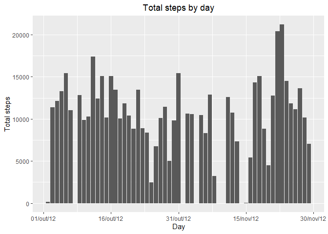
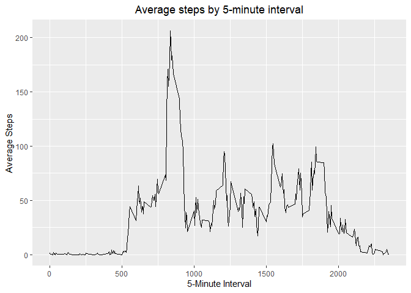
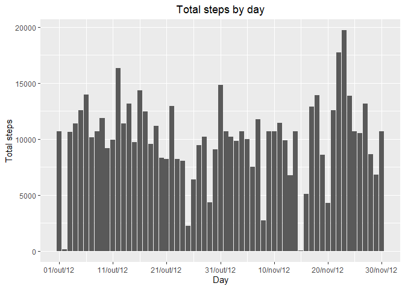
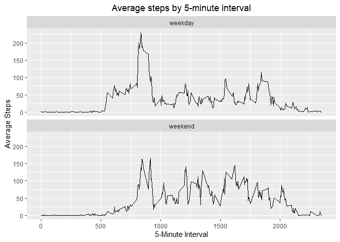

<br>


## Loading and preprocessing the data


```r
data <- read.csv(unz("activity.zip", "activity.csv"))
data$date <- as.Date(data$date)
```

<br>

## What is mean total number of steps taken per day?

Calculate the total number of steps taken per day:


```r
library(dplyr)
```

```
## 
## Attaching package: 'dplyr'
```

```
## The following objects are masked from 'package:stats':
## 
##     filter, lag
```

```
## The following objects are masked from 'package:base':
## 
##     intersect, setdiff, setequal, union
```

```r
total_per_day <- na.omit(data) %>%
        group_by(date) %>%
        summarise(total_steps = sum(steps))
```

Make a histogram of the total number of steps taken each day

```r
library(ggplot2)

ggplot(total_per_day, aes(x = date, y = total_steps)) +
        geom_bar(stat = "summary") +
        ylab("Total steps") +
        xlab("Day") +
        ggtitle("Total steps by day") +
        theme(plot.title = element_text(hjust = 0.5)) +
        scale_x_date(breaks = seq(min(data$date), max(data$date), by = 15), 
                     date_labels = "%d/%b/%y")
```

```
## No summary function supplied, defaulting to `mean_se()`
```

<!-- -->

Calculate and report the mean and median of the total number of steps 
taken per day


```r
steps_mean <- format(mean(total_per_day$total_steps), scientific = F)

steps_median <- median(total_per_day$total_steps)
```

The mean of steps by day is 10766.19 and the median is 10765

<br>

## What is the average daily activity pattern?

Make a time series plot (i.e. type = "l") of the 5-minute interval (x-axis) and
the average number of steps taken, averaged across all days (y-axis)


```r
total_interval_day <- na.omit(data) %>%
        group_by(interval) %>%
        summarise(mean_steps = mean(steps))

ggplot(total_interval_day, aes(x = interval, y = mean_steps)) +
        geom_line() +
        ylab("Average Steps") +
        xlab("5-Minute Interval") +     
        ggtitle("Average steps by 5-minute interval") +
        theme(plot.title = element_text(hjust = 0.5))
```

<!-- -->

Which 5-minute interval, on average across all the days in the dataset, 
contains the maximum number of steps?


```r
max_value <- max(total_interval_day$mean_steps)
max_interval <- total_interval_day[which.max(total_interval_day$mean_steps),
                                   "interval"]
```

The maximum number of average steps by day is 206.1698113, on the
835 interval

<br>

## Imputing missing values

Calculate and report the total number of missing values in the dataset 
(i.e. the total number of rows with NAs)


```r
total_na <- sum(is.na(data$steps))
avg_of_total_na <- round(mean(is.na(data$steps)) * 100, digits = 2)
```

The total number of missing values in the dataset is 2304, representing
13.11% of the total

Filling in all of the missing values in the dataset using the mean
for that 5-minute interval


```r
data_merged_avg <- merge(data,total_interval_day, by="interval")

data_merged_avg$steps <- ifelse(is.na(data_merged_avg$steps),
                                   data_merged_avg$mean_steps,
                                   data_merged_avg$steps)
```

Make a histogram of the total number of steps taken each day and Calculate and report the mean and median total number of steps taken per day. 


```r
ggplot(data_merged_avg, aes(x = date, y = steps)) +
        geom_bar(stat = "sum") +
        ylab("Total steps") +
        xlab("Day") +
        ggtitle("Total steps by day") +
        theme(plot.title = element_text(hjust = 0.5)) +
        scale_x_date(breaks = seq(min(data$date), 
                                  max(data$date),
                                  by = 10), 
                     date_labels = "%d/%b/%y") +
        theme(legend.position = "none")
```

<!-- -->

The values differ mainly for the time bands that, on average, have more steps,
but there is no major discrepancy in total values.


```r
total_per_day_na <- data_merged_avg %>%
        group_by(date) %>%
        summarise(total_steps = sum(steps))

steps_mean_na <- format(mean(total_per_day_na$total_steps), scientific = F)

steps_median_na <- format(median(total_per_day_na$total_steps), scientific = F)
```

The mean of steps by day, replacing NA's is 10766.19 () and the
median is 10766.19

<br>

## Are there differences in activity patterns between weekdays and weekends?

Create a new factor variable in the dataset with two levels – “weekday”
and “weekend” indicating whether a given date is a weekday or weekend day.


```r
data_merged_avg$wkd <- ifelse(weekdays(data_merged_avg$date)
                              %in% c("sábado", "domingo"),
                              "weekend",
                              "weekday")
```

Make a panel plot containing a time series plot (i.e.type = "l")
of the 5-minute interval (x-axis) and the average number of steps taken,
averaged across all weekday days or weekend days (y-axis).


```r
ggplot(data_merged_avg, aes(x = interval, y = steps)) +
        stat_summary(fun = mean, geom = "line") +
        ylab("Average Steps") +
        xlab("5-Minute Interval") +     
        ggtitle("Average steps by 5-minute interval") +
        theme(plot.title = element_text(hjust = 0.5)) +
        facet_wrap(~wkd, ncol = 1)
```

<!-- -->

